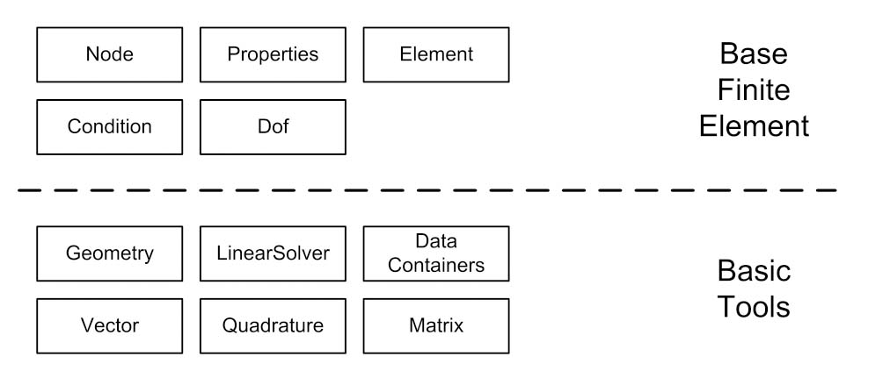
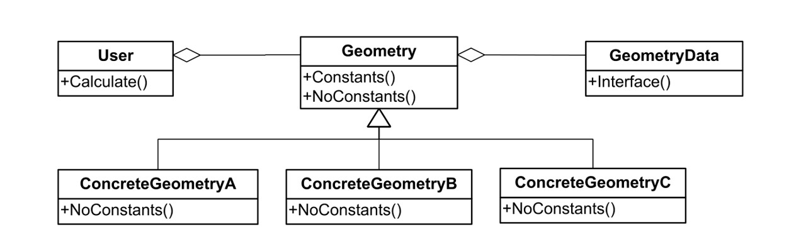
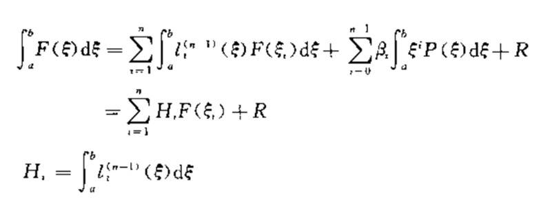
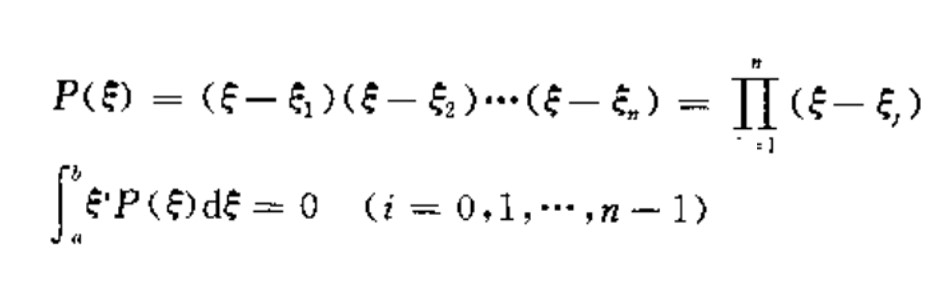

***
# Lotus Structural FEM Solver


\
A structural FEM Solver developed by Bohan Zhang. The code framework for this finite element program is based on the Kratos multi-physics software framework. Currently, this FEM solver is only used for structural analysis, so the framework has been simplified. And the data structure is also adjusted for performance considerations.

- [Lotus Structural FEM Solver](#lotus-structural-fem-solver)
  - [Framework](#framework)
  - [Basic Tools](#basic-tools)
    - [Vector and Matrix](#vector-and-matrix)
    - [Geometry](#geometry)
    - [Quadrature](#quadrature)
    - [LinearSolver](#linearsolver)
    - [DataContainers](#datacontainers)
  - [Base Finite Element](#base-finite-element)
    - [Node](#node)
    - [Properties](#properties)
    - [Element](#element)
    - [Condition](#condition)
    - [Dof](#dof)
- [Get start](#get-start)
  - [Input](#input)

## Framework
The framework of this solver has two layers, basic Tools and base finite element. Basic tools consists of geometry, linearsolver, datacontainers, vector, quadrature and matrix.
Base finite element consists of node, properties, element, condition and dof.\
Two layers structure is shown beblow.


## Basic Tools
### Vector and Matrix
Currently, `Eigen` linear algebra library is used for algebraic operations. `Eigen` is an open source cpp template library that supports vectors, dense matrix and sparse matrix operations and calculations. I'm also developping a matrix calculation library by myself. In the future, the matrix library will replace `Eigen`. 
### Geometry
Inorder to separating geometric operations and element operations, geometry tool includes dimension, points, edges and operations like central point, area, volume, and Jacobian matrix, etc. 
There are two different types of data in the `Geometry` module, one is constant data like Dimension, integration points, shape functions values, etc. and the other is nonconstant data like points, jacobian, etc.
Therefore, a `Geometry Data` class is used for storing all constant data.\
The Geometry structure is shown beblow.

### Quadrature
Obviouly, it's hard to integrating a function analytically in practice. 
So, numerial integration method were developed with the development of computer.
In fact, there are lots of effective numerial integrations methods. But `Gaussion Quadrature` is most commonly used method in finite element method.
```
There are two reasons why `Gaussion Quadrature` is suite for finite element method:
1.The integrand function has to be polynomial or approximate polynomial in `Gaussion Quadrature`.
2.The finite element method usually use complete polynomial shape funtion.
```
The generally formula for the `Gaussion Quadrature` is as follows:

Integration points can be calculated as follows:

The rationality of `Gaussion Quadrature` is not proved here.


### LinearSolver
### DataContainers

## Base Finite Element
### Node
### Properties
### Element
### Condition
### Dof


# Get start
## Input
The Node class has method that can input nodes from `Nodes.txt`  files in the following format.
```
Nsum
Number1 X Y Z
Number2 X Y Z
Number3 X Y Z
...
```
Nsum indicates the total number of nodes.
Number%x% indicates the ID of node x.
X,Y,Z represents the coordinates of each nodes.
***
The element class has method that can generate elements from `Elements.txt` file and Node object in the following format.
```
Esum ETYPE E v t stressorstrain
# IF ETYPE == 0
ENumber1 N1 N2 N3 
...
# IF ETYPE == 1
Enumber1 N1 N2 N3 N4
...
```
Esum represents the total number of elements.\
ENumber%x% represents the ID of Element x.\
E represents the Modulus of elasticity.\
v represents the Poisson's ratio.\
t represents the thickness of plate.\
stressorstrain represents plane-stress or plane-strain.\
N%x% represents the coordinates of Elements' node.
***
The Force class has method that can generate force vector from 'Force.txt' file and Force object in the following format.
```
Fsum
x y z
ENumber1 ETYPE N1 N2 q
...
```
Fsum represents the total elements that been loaded.\
x,y,z represents the direction of rou.\
ENumber represetns the number of element.\
ETYPE represents the type of stress.
```
0 represents +Y direction uniform stress, 1 represents -Y direction uniform stress.
2 represents +X direction uniform stress, 3 represents -X direction uniform stress.
```
N1,N2 represent the edge of element.\
q represent the stress.
***
The Constrain class has method that can generate constrain from "Constrain.txt" file and constrain object in the following format.
```
Csum CTYPE
Nnum1 x y
Nnum2 x y
...
```
Csum represents numbers of constrain.\
CTYPE represents type of constrain.\
Nnum represents Node that be constrained.\
x,y,z represents constrain direction.
***
